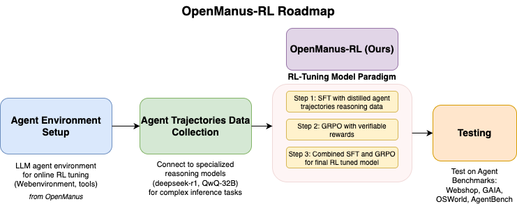
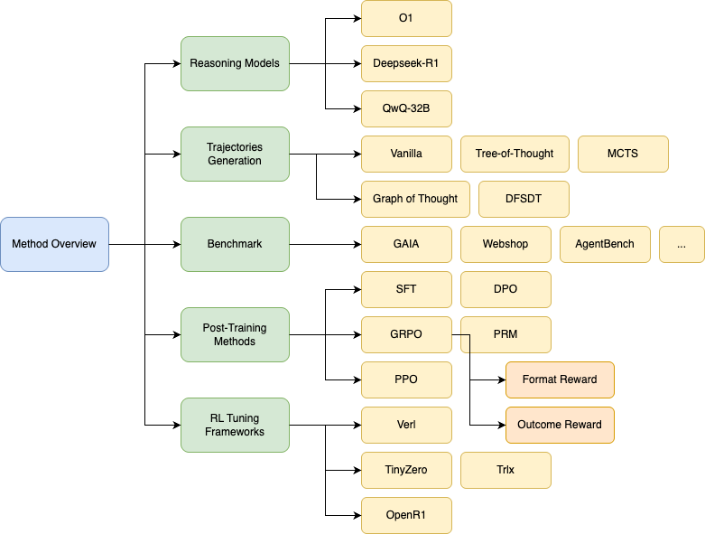

# OpenManus-RL
🤗 <a href="https://huggingface.co/datasets/CharlieDreemur/OpenManus-RL" target="_blank">Dataset (OpenManus-RL)</a>
</p>
OpenManus-RL is an open-source initiative collaboratively led by **Ulab-UIUC** and **MetaGPT**.

This project is an extended version of the original [@OpenManus](https://github.com/mannaandpoem/OpenManus) initiative. Inspired by successful RL tunning for reasoning LLM such as Deepseek-R1, QwQ-32B, we will explore new paradigms for RL-based LLM agent tuning, particularly building upon foundations.

We are committed to regularly updating our exploration directions and results in a dynamic, live-streaming fashion. All progress, including rigorous testing on agent benchmarks such as GAIA, AgentBench, WebShop, and OSWorld, and tuned models, will be openly shared and continuously updated.

We warmly welcome contributions from the broader community—join us in pushing the boundaries of agent reasoning and tool integration!

Code and dataset coming soon! Stay tuned!

<div style="display: flex; justify-content: center;">
  <div style="width: 100; transform: scale(1.0);">
    
  </div>
</div>

## 📖 Table of Contents

- [OpenManus-RL](#openmanus-rl)
  - [🔔 News](#-news)
  - [Current Team Members](#current-team-members)
  - [How to Contribute](#how-to-contribute)
  - [Roadmap](#roadmap)
  - [Method](#method)
    - [Reasoning Models Exploration](#reasoning-models-exploration)
    - [Alternative Rollout Strategies](#alternative-rollout-strategies)
    - [Environment and Benchmark](#environment-and-benchmark)
    - [Post-Training Strategies](#post-training-strategies)
    - [Training of Agent Reward Model](#training-of-agent-reward-model)
    - [Test-time Scaling of Trajectories](#test-time-scaling-of-trajectories)
    - [Action Space Awareness and Strategic Exploration](#action-space-awareness-and-strategic-exploration)
    - [Integration with RL Tuning Frameworks](#integration-with-rl-tuning-frameworks)
  - [Dataset](#dataset)
    - [Dataset Overbiew](#dataset-overview)
    - [Data Instances](#data-instances)
- [Running](#Running)
- [Related Work](#related-work)
  - [Agent tuning](#agent-tuning)
  - [Tool using](#tool-using)
  - [Agent tuning instruction dataset](#agent-tuning-instruction-dataset)
  - [RL tuning](#rl-tuning)
  - [Benchmark](#benchmark)
  - [Similar Code](#similar-code)
- [Acknowledgement](#acknowledgement)
- [Community Group](#community-group)
- [Citation](#citation)

---


## 🔔 News
- **[2025-03-09]** 🍺 We collect and opensource our Agent SFT dataset at [Huggingface](https://huggingface.co/datasets/CharlieDreemur/OpenManus-RL), go try it!
- **[2025-03-08]** 🎉 We are collaborating with [@OpenManus](https://github.com/mannaandpoem/OpenManus) from Metagpt to work on this project together!
- **[2025-03-06]** 🥳 We(UIUC-Ulab) are announcing our live-streaming project, OpenManus-RL.


## Current Team Members
[@Kunlun Zhu](https://github.com/Kunlun-Zhu)(Ulab-UIUC), [@Jiayi Zhang](https://github.com/didiforgithub)(MetaGPT), [@Xiangxin Zhou](https://github.com/zhouxiangxin1998), [@Yanfei Zhang](https://github.com/yanfei-zhang-95), [@Yingxuan Yang](https://github.com/zoe-yyx), [@Weijia Zhang](https://github.com/CharlieDreemur), [@Muxin Tian](https://github.com/realtmxi), [@Haofei Yu](https://github.com/lwaekfjlk)(Ulab-UIUC)

---

# How to Contribute
We wholeheartedly welcome suggestions, feedback, and contributions from the community! Feel free to:

We welcome contributions, including fine-tuning codebase, tuning dataset, environment setup, and computing resources.
Create issues for feature requests, bug reports, or ideas.
Submit pull requests to help improve OpenManus-RL.
Or simply reach out to us for direct collaboration.
Important contributors will be listed as co-authors to our paper.

# Roadmap
1. Agent Environment Support
Setting up LLM agent environment for online RL tunning.

2. Agent Trajectories Data Collection
Connect to specialized reasoning models such as deepseek-r1, QwQ-32B for more complex inference tasks to collect comprehensive agent trajectories.

3. RL-Tuning Model Paradigm
Provide an RL fine-tuning approach for customizing the agent’s behavior in our agent environment.

4. Test on Agent Benchmarks
Evaluate our framework on agentic benchmark such as Webshop, GAIA, OSWorld, AgentBench


<div style="display: flex; justify-content: center;">
  <div style="width: 100; transform: scale(1.0);">
    
  </div>
</div>

## Method

Our method proposes an advanced reinforcement learning (RL)-based agent tuning framework designed to significantly enhance reasoning and decision-making capabilities of large language models (LLMs). Drawing inspiration from RAGEN's Reasoning-Interaction Chain Optimization (RICO), our approach further explores novel algorithmic structures, diverse reasoning paradigms, sophisticated reward strategies, and extensive benchmark environments.

### Reasoning Models Exploration
To benchmark the reasoning capabilities effectively, we evaluate multiple state-of-the-art reasoning models:
- **GPT-O1**
- **Deepseek-R1**
- **QwQ-32B**

Each model provides unique reasoning capabilities that inform downstream optimization and training strategies.

### Alternative Rollout Strategies
We experiment with a variety of rollout strategies to enhance agent planning efficiency and reasoning robustness, including:

- **Tree-of-Thoughts (ToT)**: Employs tree-based reasoning paths, enabling agents to explore branching possibilities systematically.
- **Graph-of-Thoughts (GoT)**: Utilizes graph structures to represent complex reasoning dependencies effectively.
- **DFSDT (Depth-First Search Decision Trees)**: Optimizes action selection through depth-first search, enhancing long-horizon planning.
- **Monte Carlo Tree Search (MCTS)**: Explores reasoning and decision paths probabilistically, balancing exploration and exploitation effectively.

These methods help identify optimal rollout techniques for various reasoning tasks.

### Diverse Reasoning Formats
We specifically analyze and compare several reasoning output formats, notably:

- **ReAct**: Integrates reasoning and action explicitly, encouraging structured decision-making.
- **Outcome-based Reasoning**: Optimizes toward explicit outcome predictions, driving focused goal alignment.

These formats are rigorously compared to derive the most effective reasoning representation for various tasks.

### Post-Training Strategies
We investigate multiple post-training methodologies to fine-tune agent reasoning effectively:

- **Supervised Fine-Tuning (SFT)**: Initializes reasoning capabilities using human-annotated instructions.
- **Generalized Reward-based Policy Optimization (GRPO)**: Incorporates:
    - **Format-based Rewards**: Rewards adherence to specified reasoning structures.
    - **Outcome-based Rewards**: Rewards accurate task completion and goal attainment.
- **Proximal Policy Optimization (PPO)**: Enhances agent stability through proximal updates.
- **Direct Preference Optimization (DPO)**: Leverages explicit human preferences to optimize agent outputs directly.
- **Preference-based Reward Modeling (PRM)**: Uses learned reward functions derived from human preference data.

### Training of Agent Reward Model
We train specialized agent reward models using annotated data to accurately quantify nuanced reward signals. These models are then leveraged to guide agent trajectory selection during both training and evaluation phases.

### Test-time Scaling of Trajectories
During the inference phase, trajectory scaling methods are implemented, allowing agents to flexibly adapt to varying task complexities, thus enhancing robustness and performance in real-world scenarios.

### Action Space Awareness and Strategic Exploration
Agents are equipped with action-space awareness, employing systematic exploration strategies designed to navigate complex action spaces effectively, ultimately maximizing expected rewards.

### Integration with RL Tuning Frameworks
We integrate insights and methodologies from leading RL tuning frameworks, including:

- **Verl**
- **TinyZero**
- **OpenR1**
- **Trlx**

Through these frameworks, agents can effectively balance exploration and exploitation, optimize reasoning processes, and adapt dynamically to novel environments.

In summary, our method systematically integrates advanced reasoning paradigms, diverse rollout strategies, sophisticated reward modeling, and robust RL frameworks, significantly advancing the capability and adaptability of reasoning-enhanced LLM agents.

<div style="display: flex; justify-content: center;">
  <div style="width: 100; transform: scale(1.0);">
    
  </div>
</div>

# Dataset
[**OpenManusRL-Dataset**](https://huggingface.co/datasets/CharlieDreemur/OpenManus-RL) combines agent trajectories from [AgentInstruct](https://huggingface.co/datasets/THUDM/AgentInstruct) and [Agent-FLAN](https://huggingface.co/datasets/internlm/Agent-FLAN) with features:

- 🔍 **ReAct Framework** - <a href="https://react-lm.github.io/" target="_blank">Reasoning-Acting integration</a>
- 🧠 **Structured Training** - Separate format/reasoning learning
- 🚫 **Anti-Hallucination** - Negative samples + environment grounding
- 🌐 **6 Domains** - OS, DB, Web, KG, Household, E-commerce

## Dataset Overview

| Source | Trajectories | Avg Turns | Key Features |
|--------|--------------|-----------|--------------|
| [AgentInstruct](https://huggingface.co/datasets/THUDM/AgentInstruct) | 1,866 | 5.24 | 	Multi-task QA, CoT reasoning |
| [Agent-FLAN](https://huggingface.co/datasets/internlm/Agent-FLAN) | 34,442 | 3-35 | Error recovery patterns, diverse real-world tasks |
| **Combined** | 36,308 | 4-20 | Enhanced generalization, broader task coverage |

### Supported Tasks
- **text-generation**: ReAct-style instruction following
- **conversational-ai**: Tool-augmented dialogues

### Languages
English

## Data Instances

**ReAct Pattern Example**:
```json
{
  "id": "os_0",
  "conversations": [
    {"role": "user", "content": "Count files in /etc"},
    {"role": "assistant", "content": "Think: Need reliable counting method\nAct: bash\n```bash\nls -1 /etc | wc -l\n```"},
    {"role": "user", "content": "OS Output: 220"},
    {"role": "assistant", "content": "Think: Verified through execution\nAct: answer(220)"}
  ]
}
```

# Running

## OpenManus-RL

A simplified library for Supervised Fine-Tuning (SFT) and GRPO tunning of language models for agentic system. (developed upon [Open-R1](https://github.com/huggingface/open-r1) from huggingface)
We are still laboriously developing this part, welcome feedback.

## Installation

First, create a conda environment and activate it:

```bash
conda create -n openmanus-rl python=3.10
conda activate openmanus-rl
```

Then, install the required dependencies:


```bash
pip install -r requirements.txt
```

Supervised Fine-Tuning (SFT)

Basic Usage

To fine-tune a model on a single GPU:


```bash
python -m openmanus_rl.sft \
    --model_name_or_path Qwen/Qwen2.5-1.5B-Instruct \
    --dataset_name CharlieDreemur/OpenManus-RL \
    --learning_rate 2.0e-5 \
    --num_train_epochs 1 \
    --packing \
    --max_seq_length 4096 \
    --per_device_train_batch_size 2 \
    --gradient_accumulation_steps 8 \
    --gradient_checkpointing \
    --bf16 \
    --logging_steps 5 \
    --output_dir data/sft-output
```

Distributed Training with Accelerate

For multi-GPU training using Accelerate:


```bash
accelerate launch --config_file=configs/accelerate_configs/zero3.yaml openmanus_rl/sft.py \
    --model_name_or_path Qwen/Qwen2.5-1.5B-Instruct \
    --dataset_name CharlieDreemur/OpenManus-RL \
    --learning_rate 2.0e-5 \
    --num_train_epochs 1 \
    --packing \
    --max_seq_length 4096 \
    --per_device_train_batch_size 2 \
    --gradient_accumulation_steps 8 \
    --gradient_checkpointing \
    --bf16 \
    --logging_steps 5 \
    --output_dir data/sft-output
```

## Gradient-based Reinforcement for Policy Optimization (GRPO) for agent tunning
Basic Usage
To fine-tune a model using GRPO on a single GPU:

```bash
python -m openmanus_rl.grpo \
    --model_name_or_path Qwen/Qwen2.5-1.5B-Instruct \
    --dataset_name CharlieDreemur/OpenManus-RL-GRPO \
    --learning_rate 2.0e-5 \
    --num_train_epochs 1 \
    --max_seq_length 4096 \
    --per_device_train_batch_size 2 \
    --gradient_accumulation_steps 8 \
    --gradient_checkpointing \
    --bf16 \
    --reward_funcs accuracy format tag_count \
    --logging_steps 5 \
    --output_dir data/grpo-output
```
Distributed Training with Accelerate
For multi-GPU training using Accelerate:

```bash
accelerate launch --config_file=configs/accelerate_configs/zero3.yaml openmanus_rl/grpo.py \
    --model_name_or_path Qwen/Qwen2.5-1.5B-Instruct \
    --dataset_name CharlieDreemur/OpenManus-RL-GRPO \
    --learning_rate 2.0e-5 \
    --num_train_epochs 1 \
    --max_seq_length 4096 \
    --per_device_train_batch_size 2 \
    --gradient_accumulation_steps 8 \
    --gradient_checkpointing \
    --bf16 \
    --reward_funcs accuracy format tag_count \
    --logging_steps 5 \
    --output_dir data/grpo-output
```


# Related Work

## Agent tuning

1. **Offline Training of Language Model Agents with Functions as Learnable Weights**. [[paper](https://arxiv.org/pdf/2402.11359)]
2. **FIREACT : TOWARD LANGUAGE AGENT FINE-TUNING**. [[paper](https://arxiv.org/pdf/2310.05915)]
3. **AgentTuning: Enabling Generalized Agent Abilities for LLMs**. [[paper](https://arxiv.org/pdf/2310.12823)]
4. **ReAct Meets ActRe: When Language Agents Enjoy Training Data Autonomy**. [[paper](https://arxiv.org/pdf/2403.14589)]
5. **UI-TARS: Pioneering Automated GUI Interaction with Native Agents**. [[paper](https://arxiv.org/pdf/2501.12326#page=16.83)]
6. **ATLAS: Agent Tuning via Learning Critical Steps**. [[paper](https://arxiv.org/pdf/2503.02197)]

## Tool using

1. **Toolformer: Language Models Can Teach Themselves to Use Tools**. [[paper](https://arxiv.org/pdf/2302.04761)]
2. **ToolLLM: Facilitating Large Language Models to Master 16000+ Real-world APIs**. [[paper](https://arxiv.org/abs/2307.16789)]

## Agent tuning instruction dataset

1. **Agent-FLAN: Designing Data and Methods of Effective Agent Tuning for Large Language Models**. [[paper](https://arxiv.org/pdf/2403.12881)]
2. **AgentOhana: Design Unified Data and Training Pipeline for Effective Agent Learning**. [[paper](https://arxiv.org/pdf/2402.15506)]

## RL tuning

1. **Training Language Models to Follow Instructions with Human Feedback**. [[paper](https://arxiv.org/pdf/2305.18438)]
2. **Deepseekmath: Pushing the Limits of Mathematical Reasoning in Open Language Models**. [[paper](https://proceedings.neurips.cc/paper_files/paper/2022/file/b1efde53be364a73914f58805a001731-Paper-Conference.pdf)]
3. **DeepSeek-R1: Incentivizing Reasoning Capability in LLMs via Reinforcement Learning**. [[paper](https://arxiv.org/pdf/2501.12948)]

## **Benchmark:**

1. **AgentBench: Evaluating LLMs as Agents**. [paper](https://arxiv.org/abs/2308.03688)
2. **OSWorld: Benchmarking Multimodal Agents for Open-Ended Tasks in Real Computer Environments**. [paper](https://arxiv.org/abs/2404.07972)
3. **AndroidWorld: A Dynamic Benchmarking Environment for Autonomous Agents**. [paper](https://openreview.net/forum?id=il5yUQsrjC)
4. **WebShop: Towards Scalable Real-World Web Interaction with Autonomous Agents**. [paper](https://arxiv.org/pdf/2207.01206)
5. **GAIA: a benchmark for General AI Assistants**. [paper](https://arxiv.org/abs/2311.12983)
6. **TheAgentCompany: Benchmarking LLM Agents on Consequential Real World Tasks**. [paper](https://arxiv.org/abs/2412.14161)


## Similar Code

1. **RAGEN: Training Agents by Reinforcing Reasoning**. [[code](https://github.com/ZihanWang314/RAGEN)]

# Acknowledgement
We extend our thanks to ulab-uiuc (https://ulab-uiuc.github.io/) and Openmanus (https://github.com/mannaandpoem/OpenManus)) team from MetaGPT for their support and shared knowledge. Their mission and community contributions help drive innovations like OpenManus forward.
We welcome all developers who are interested in this project can reach out to (kunlunz2@illinois.edu)

Stay tuned for updates and the official release of our repository. Together, let's build a thriving open-source agent ecosystem!

# Community Group

Join our networking group on Wecgat and share your experience with other developers!

<div align="center" style="display: flex; gap: 20px;">
    
</div>

# Citation
Please cite the following paper if you find OpenManus helpful!
```bibtex
@misc{OpenManus,
  author       = {OpenManus-RL Team},
  title        = {OpenManus-RL: Open Platform for Generalist LLM Reasoning Agents with RL optimization},
  year         = {2025},
  organization = {GitHub},
  url          = {https://github.com/OpenManus/OpenManus-RL},
}
```

<p align="center">
<a href="https://star-history.com/#Significant-Gravitas/AutoGPT">
  <picture>
    <source media="(prefers-color-scheme: dark)" srcset="https://api.star-history.com/svg?repos=OpenManus/OpenManus-RL&type=Date&theme=dark" />
    <source media="(prefers-color-scheme: light)" srcset="https://api.star-history.com/svg?repos=OpenManus/OpenManus-RL&type=Date" />
    
  </picture>
</a>
</p>
